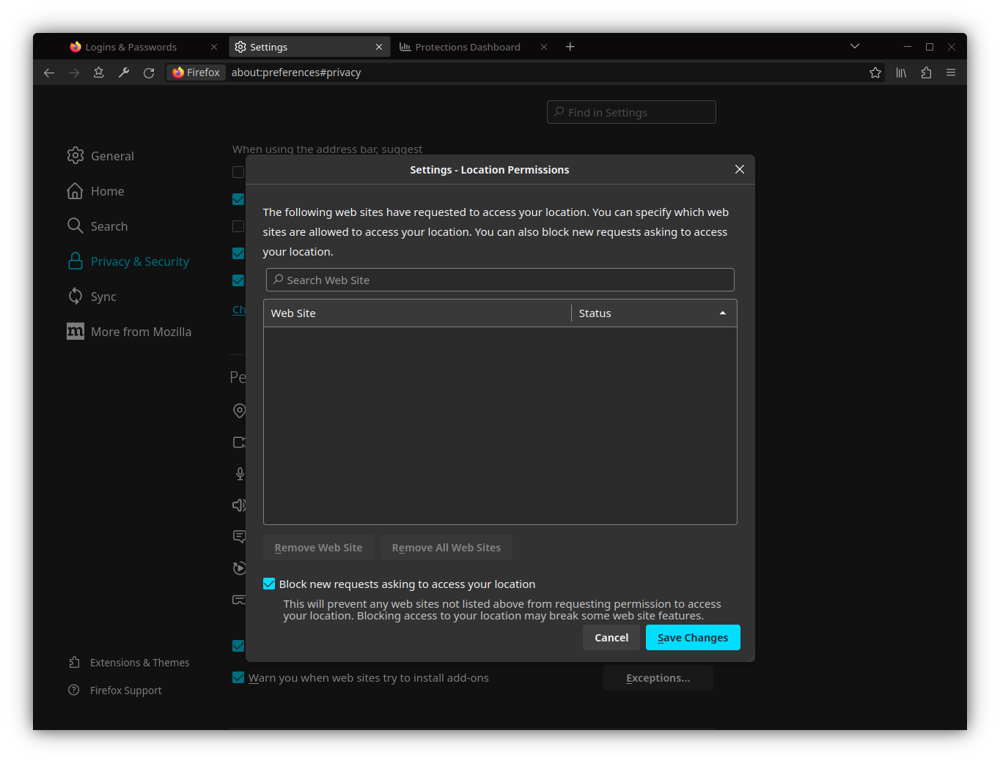

# Night Shadow

Night Shadow: a theme with a dark color scheme that fully modifies the appearance of Firefox browser far beyond the built-in customization features.

### Firefox advanced customization with CSS

Firefox’s user interface is built of web-like elements (HTML and XUL elements) and styled using CSS. Thus, In addition to the built-in Customize features, Firefox themes and other types of add-ons, there are additional options for changing the appearance (user interface) of Firefox browser by applying style rules with an optional files named [userChrome.css](https://www.userchrome.org/) and userContent.css.

Using the aforementioned technique, the Night Shadow theme's color scheme is applied to all elements of the Firefox interface (including, panels, internal windows etc.).

## Screenshots

More screenshots

## Download and installation instructions

1. Install the core theme files in the Add-ons for Firefox web portal (addons.mozilla.org) by clicking the "Install Theme" button: [https://addons.mozilla.org/en-GB/firefox/addon/night-shadow/](https://addons.mozilla.org/en-GB/firefox/addon/night-shadow/)

2. Find your Firefox profile directory:
    - Type `about:support` in the address bar and press "Enter"
    - Go to "Profile Directory (Linux)" / "Profile Folder (Windows)" entry and click on "Open Directory (Linux)" / "Open Folder (Windows)" button

3. Download additional theme files from the "Releases" section in the right side of this page, unzip the downloaded archive and copy the "chrome" directory to the previously opened Firefox profile directory

4. Enable Loading of userChrome.css and userContent.css in Firefox:
    - Type `about:config` in the address bar and press "Enter", click "Accept the Risk and Continue" to go to the about:config page
    - Search for the `toolkit.legacyUserProfileCustomizations.stylesheets` preference and switch its value from `false` to `true`
    - Restart Firefox

### How to revert Firefox back to its default state?

If Firefox user interface suddenly looks broken after an update, you can temporarily disable the use of userChrome.css and userContent.css files and revert Firefox back to its default state:

1. Type `about:config` in the address bar and press "Enter", click "Accept the Risk and Continue" to go to the about:config page

2. Search for the `toolkit.legacyUserProfileCustomizations.stylesheets` preference and set it back to `false` by clicking on "Reset" button

3. Remove `chrome` directory from the Firefox profile directory

4. Restart Firefox

## License

Licensed under the [GNU General Public License v3.0](https://github.com/serhiyguryev/black-jade-theme/blob/main/LICENSE)
