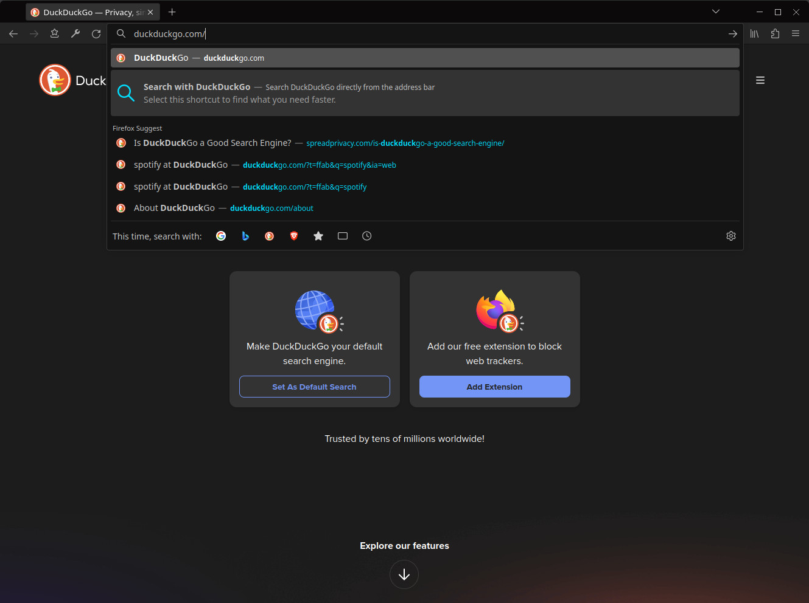
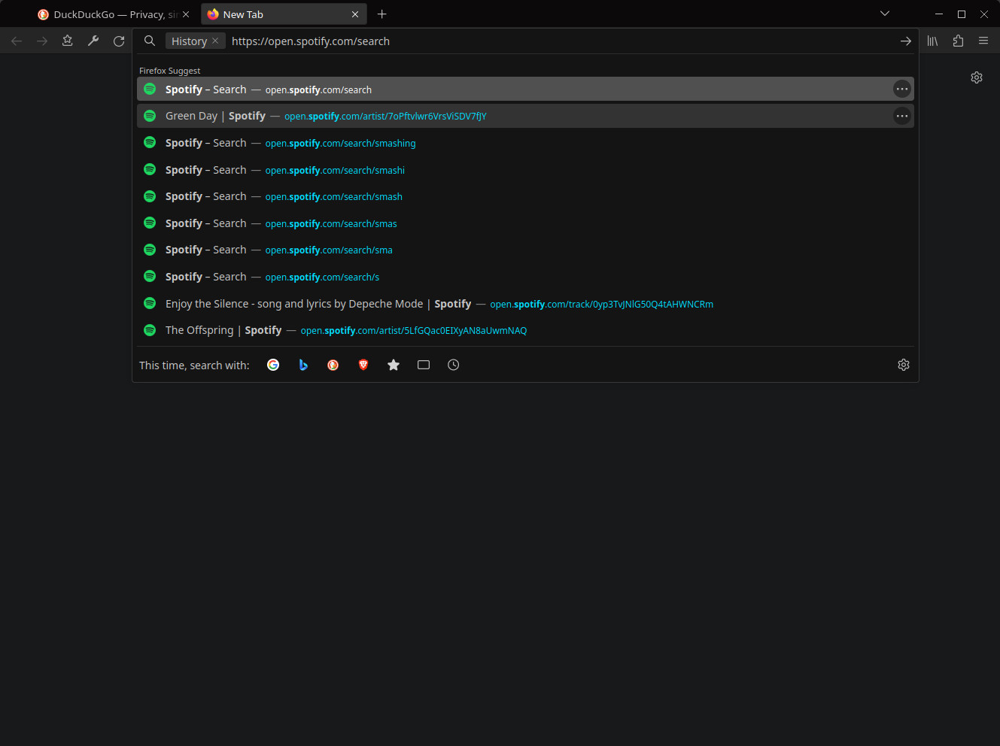
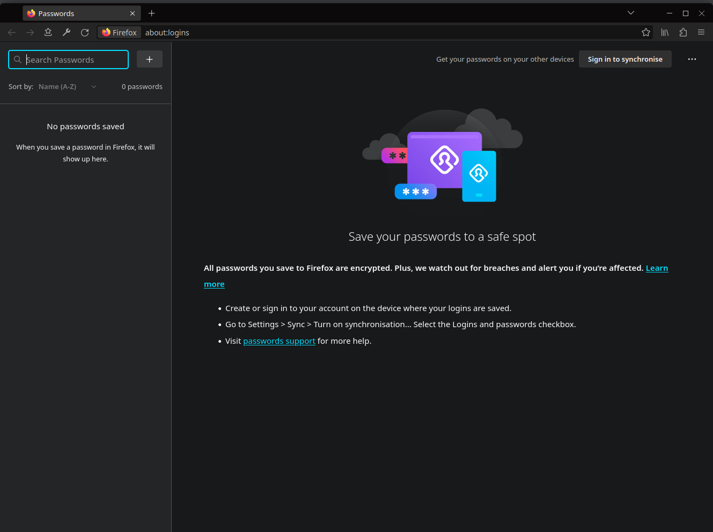
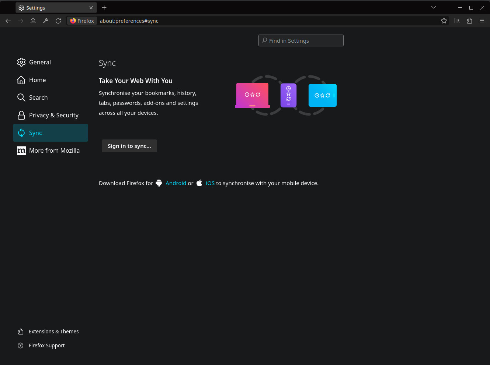
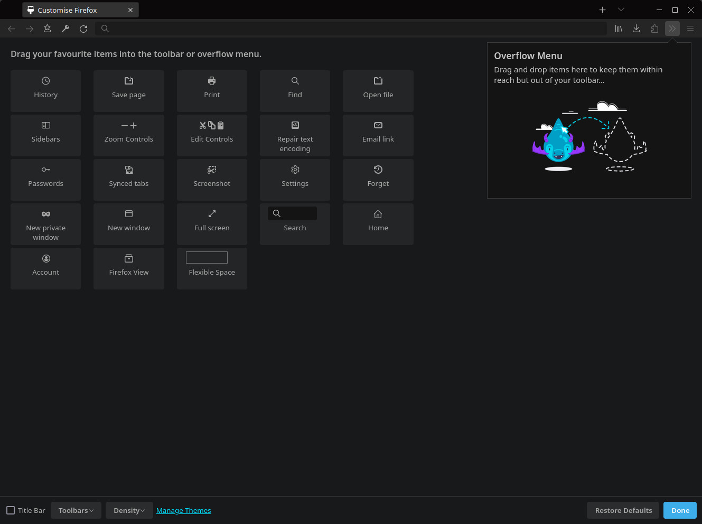
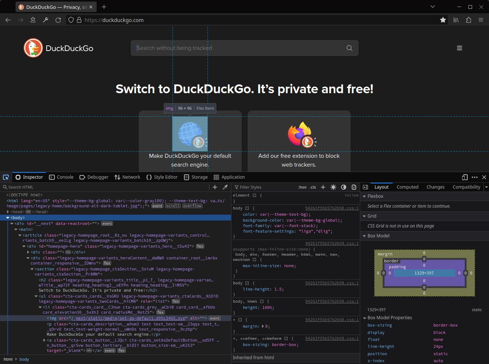
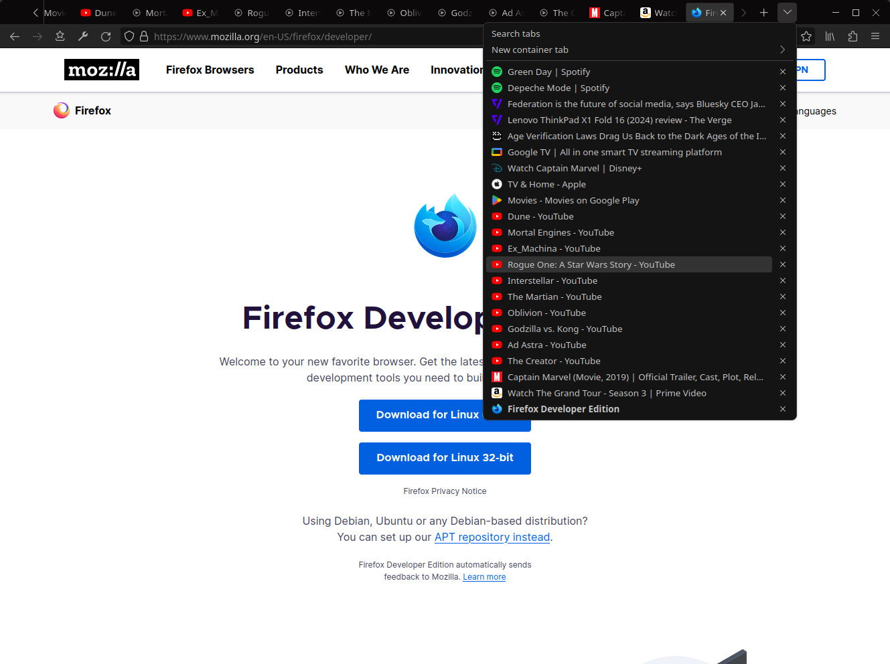
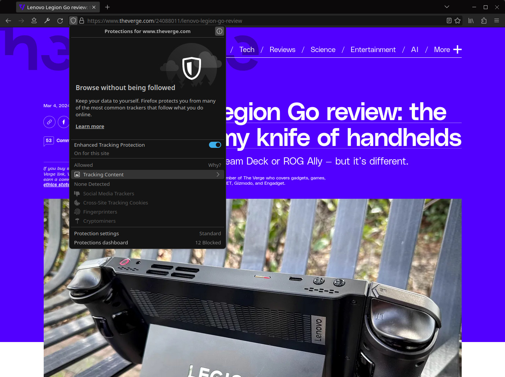
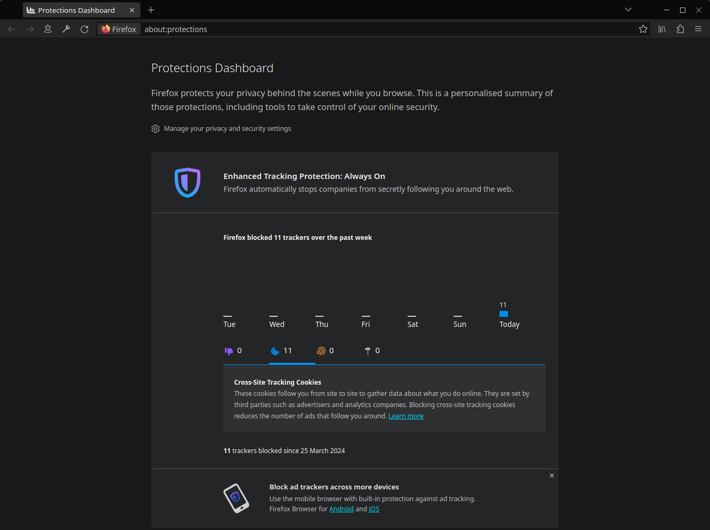
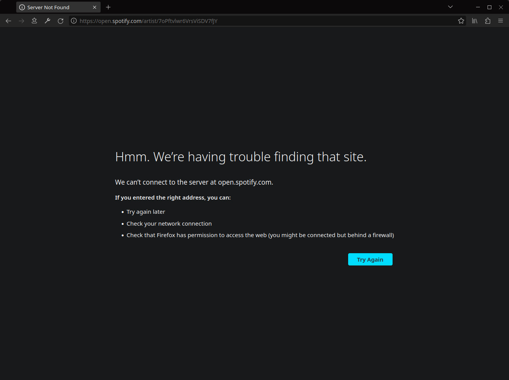

# Black Fox (Firefox theme)

Black Fox: a theme with a dark color scheme that fully modifies the appearance of Firefox browser far beyond the built-in customization features.

### Firefox advanced customization with CSS

Firefox’s user interface is built of web-like elements (HTML and XUL elements) and styled using CSS. Thus, there are additional options for changing the appearance (user interface) of Firefox browser by applying style rules with an optional files named [userChrome.css](https://www.userchrome.org/) and userContent.css. With these files, the Black Fox theme's color scheme is applied to all elements of the Firefox interface, including: internal pages (all about: pages), dialog windows, error pages, infobars, developer tools etc.

> [!IMPORTANT]
> Since the changes are mainly made in **userChrome.css** and **userContent.css** files, which are not updated automatically with the theme, you should check the theme's GitHub repository from time to time for updated versions of these files (last update date: 2024-07-29)

## Screenshots



<details>
<summary>More screenshots</summary>




















</details>

## Download and installation instructions

1. Install the core theme files on the "Add-ons for Firefox" web portal (addons.mozilla.org) by clicking the "Install Theme" button: [https://addons.mozilla.org/en-GB/firefox/addon/black-fox-theme/](https://addons.mozilla.org/en-GB/firefox/addon/black-fox-theme/)

2. Find your Firefox profile directory:
    - Type `about:support` in the address bar and press "Enter"
    - Go to "Profile Directory (Linux)" / "Profile Folder (Windows)" entry and click on "Open Directory (Linux)" / "Open Folder (Windows)" button

3. Download additional theme files, unzip the downloaded archive and copy the "chrome" directory to the previously opened Firefox profile directory: [chrome.zip, v24.07 (2024-07-29)](https://github.com/serhiyguryev/black-fox-theme/releases/download/v24.04/chrome.zip), SHA1: 476028f44d24f5e091c3094b8342f63f6e59a852

4. Enable Loading of userChrome.css and userContent.css in Firefox:
    - Type `about:config` in the address bar and press "Enter", click "Accept the Risk and Continue" to go to the about:config page
    - Search for the `toolkit.legacyUserProfileCustomizations.stylesheets` preference and switch its value from `false` to `true`
    - Restart Firefox

## How to revert Firefox back to its default state?

If Firefox user interface suddenly looks broken after an update, you can temporarily disable the use of userChrome.css and userContent.css files and revert Firefox back to its default state:

1. Type `about:config` in the address bar and press "Enter", click "Accept the Risk and Continue" to go to the about:config page

2. Search for the `toolkit.legacyUserProfileCustomizations.stylesheets` preference and set it back to `false` by clicking on "Reset" button

3. Remove `chrome` directory from the Firefox profile directory

4. Restart Firefox

## Firefox extensions (Add-ons)

This theme also modifies the appearance of the [uBlock Origin](https://addons.mozilla.org/en-US/firefox/addon/ublock-origin/) and [SingleFile](https://addons.mozilla.org/en-US/firefox/addon/single-file/) extension settings pages. If you want to use these extensions without any modifications, you can comment out the following @import CSS at-rules contained in **userContent.css**:

```css
/* @import url('night-shadow-theme/extensions/ublock-origin.css'); */
/* @import url('night-shadow-theme/extensions/singlefile.css'); */
```

## Support my work

You can support the further development of this project by choosing a convenient way to donate:

* **Bitcoin (BTC)**: bc1q6qtnwc2pdktvl48mr9hf0qmhaxfm7xseftp78a
* **Ether (ETH)**: 0x185e4FB1f662223B011dedbBd42A444891b094f5

## License

Licensed under the [GNU General Public License v3.0](https://github.com/serhiyguryev/black-fox-theme/blob/main/LICENSE)
